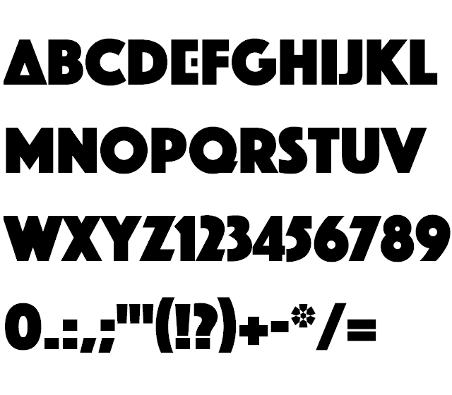

# Arcade Legends Font
This font is based on the font **Phosphate Pro**, which can be found [here](https://www.dfonts.org/fonts/phosphate-pro-full-family/). The modified typeface is a recreation of the typeface used by AtGames for the Legends line of products.

Only the uppercase letters have been modified. The lowercase letters represent the original typeface.

I relinquish all rights to my modifications to this font, minor as they are. The original font is free for non-commercial use.
