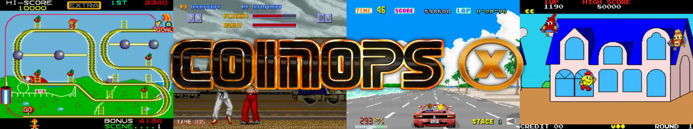
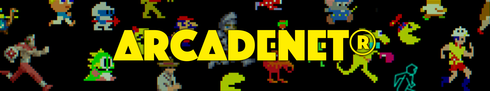
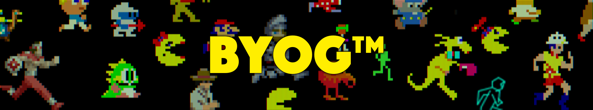
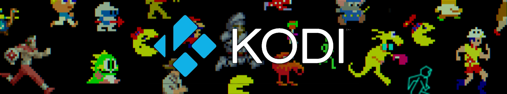

# BitLCD Marquees
These marquees go in the `/bitlcd/thirdparty` directory of the BitLCD USB drive.
## Legends Ultimate Marquee.jpg/Legends Ultimate Marquee.mp4/Legends Ultimate Marquee (Built-in games only).mp4
This is a marquee designed to mimic the original static ALU 1.1 marquee.

There are two video marquees that go with the still image. One displays arcade games, and the other is limited to games contained on the ALU out of the box, but displays both arcade and console games.

They need to renamed to replace a menu marquee, such as "Games".

## CoinOpsX.jpg/CoinOpsx.mp4
This is a marquee similar to the Legends Ultimate marquee above, but for Coin Ops X. It doesn't waste time with a black background.

## Legends Ultimate Logo
This is a reproduction of the Legends Ultimate logo, for use in your own marquee images.

## BitLCD Menus.zip/BitLCD Menus 2.zip
These menu marquee images show video game characters with the menu text presented in the Arcade Legends font.

